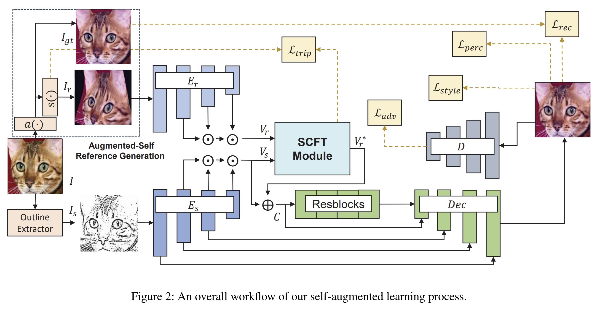
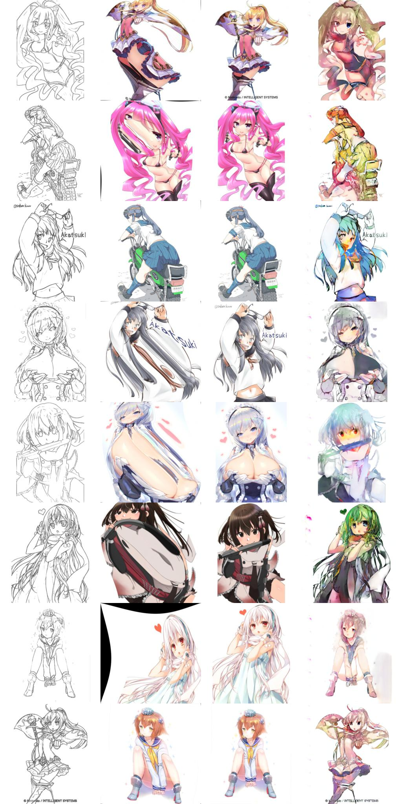
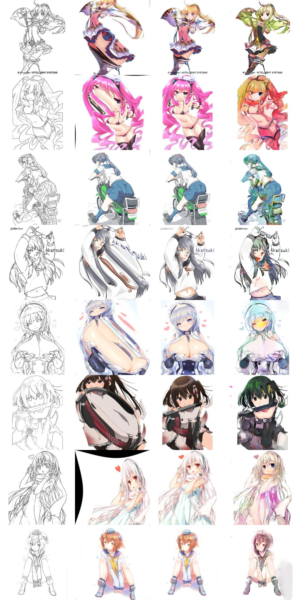
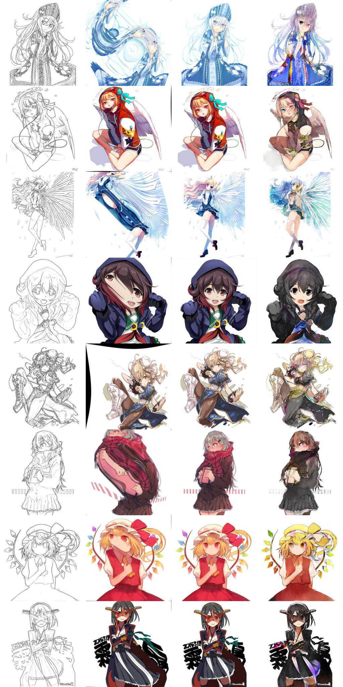

# Reference_based_Skectch_Image_Colorization

This repository implements the paper ["Reference based Sketch Image Colorization using Augmented-Self Reference and Dense Semantic Correspondence"](https://arxiv.org/abs/2005.05207) published in CVPR2020.

## Requirements
* python3.6+
* pytorch 1.6.0
* others.

## Usage
training a model
```bash
python3 main.py --config config.yml
```

testing a model
```bash
Not implmented yet
```

## Architecture

## Results




## Comments
 In this implementation, the triplet loss function is meaningless. It always show zeros for scaled dot product and l2 norm distance, if I am wrong, please make issue. Without the triplet loss, we can obtain good results. Even if a model is trained only 2 epochs, the model shows meaningful results.
## Reference
1. tps_transform : https://github.com/cheind/py-thin-plate-spline
2. spectral normalization : https://github.com/christiancosgrove/pytorch-spectral-normalization-gan/blob/master/spectral_normalization.py
3. unet : https://github.com/milesial/Pytorch-UNet
4. dataset : https://www.kaggle.com/ktaebum/anime-sketch-colorization-pair
